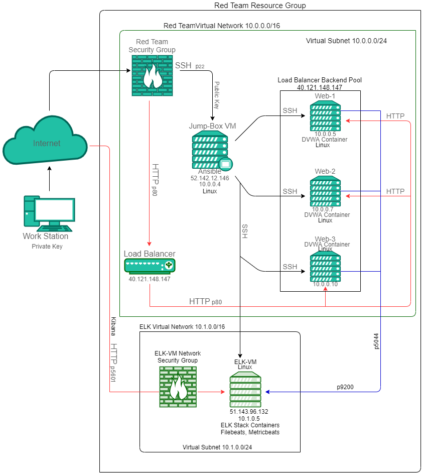
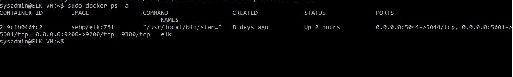

## Automated ELK Stack Deployment

The files in this repository were used to configure the network depicted below.

These files have been tested and used to generate a live ELK deployment on Azure. They can be used to either recreate the entire deployment pictured above. Alternatively, select portions of the _____ file may be used to install only certain pieces of it, such as Filebeat.

  - _[Install ELK](Ansible/install-elk.yml)_
  - _[Filebeat](Ansible/filebeat-playbook.yml)_
  - _[Metricbeat](Ansible/metricbeat-playbook.yml)_

This document contains the following details:
- Description of the Topologu
- Access Policies
- ELK Configuration
  - Beats in Use
  - Machines Being Monitored
- How to Use the Ansible Build

### Description of the Topology

The main purpose of this network is to expose a load-balanced and monitored instance of DVWA, the D*mn Vulnerable Web Application.

Load balancing ensures that the application will be highly efficient, flexible, in addition to restricting an overload of traffic (high availability) to the network. It also helps reduce redundancies, increases performace and reduces catastrophic network outages by allowing all the redundant servers handle the workload.
- What aspect of security do load balancers protect? 
  - Load balancers protect the network distribution. They sit between the clients devices and backend servers.
- What is the advantage of a jump box? The jump box is a secure computer that provides a gateway to the servers. 
  - The jump box provides a segregation layer for the network and only allows my machine to connect to the jumpbox which therefore reduces the attack surface area. 

Integrating an ELK server allows users to easily monitor the vulnerable VMs for changes to the _____ and system _____.
- What does Filebeat watch for? 
  - Filebeat is an agent installed on the webservers to monitor; log files, or specified locations, collect log events and forward them to the Elasticsearch for indexing. It also montiors for SSH logins, system logs, and sudo commands
- What does Metricbeat record? 
  - It is an agent installed on the webserves to collect metrics from the operating system such as CPU, RAM, network usage, and services running on the servers and ships them to the Elasticsearch.

The configuration details of each machine may be found below.
_Note: Use the [Markdown Table Generator](http://www.tablesgenerator.com/markdown_tables) to add/remove values from the table_.

| Name        | Function       | IP Address | Operating System |
|-------------|----------------|------------|------------------|
| Jump Box VM | Jumpbox (VM)        | 10.0.0.4   | Linux            |
| Web 1       | Web Host       | 10.0.0.5   | Linux            |
| Web 2       | Web Host       | 10.0.0.7   | Linux            |
| Web 3       | Web Host       | 10.0.0.10  | Linux            |
| ELK VM      | Log Aggregator | 10.1.0.5   | Linux            |

### Access Policies

The machines on the internal network are not exposed to the public Internet. 

Only the _Jump Box VM and ELK VM____ machine can accept connections from the Internet. Access to this machine is only allowed from the following IP addresses: 
- Add whitelisted IP addresses
  - My public IP

Machines within the network can only be accessed by Jump Box VM.
- Which machine did you allow to access your ELK VM? What was its IP address?
  - Jumpbox IP 

A summary of the access policies in place can be found in the table below.

| Name        | Publicly Accessible | Allowed IP Addresses    |
|-------------|---------------------|-------------------------|
| Jump Box VM | Yes                 | My Public IP        |
| ELK VM      | Yes                 | Jumpbox IP, My public IP |

### Elk Configuration

Ansible was used to automate configuration of the ELK machine. No configuration was performed manually, which is advantageous because...
- What is the main advantage of automating configuration with Ansible? 
  - Ansible helped with the configuration mamagement and application deployment across the different containers in the network. It helped make deployment fast/efficient across the project lifecycle. It also offered flexibility and consistency in deployment.

The playbook implements the following tasks:
  - Install docker.io
  - Installed the python module,
  - Installed the elk container and set the max memory to use at least 2GB of RAM
  - Ran and setup the ELK container

The following screenshot displays the result of running `docker ps` after successfully configuring the ELK instance.

### Target Machines & Beats
This ELK server is configured to monitor the following machines:
- List the IP addresses of the machines you are monitoring
  - 10.0.0.5, 10.0.0.7, 10.0.0.10

We have installed the following Beats on these machines:
- Filebeats, Metricbeats

These Beats allow us to collect the following information from each machine:
-  In 1-2 sentences, explain what kind of data each beat collects, and provide 1 example of what you expect to see. E.g., `Winlogbeat` collects Windows logs, which we use to track user logon events, etc.
    - Filebeat is an agent installed on the webservers to monitor; log files, or specified locations, collect log events and forward them to the Elasticsearch for indexing. It also montiors for SSH logins, system logs, and sudo commands.
    - Metricbeat is an agent installed on the webserves to collect metrics from the operating system such as CPU, RAM, network usage, and services running on the servers and ships them to the Elasticsearch.

### Using the Playbook
In order to use the playbook, you will need to have an Ansible control node already configured. Assuming you have such a control node provisioned: 

SSH into the control node and follow the steps below:
- Copy the `/etc/ansible/files/filebeat-config.yml` file to `/etc/filebeat/filebeat.yml`.
- Update the `/etc/ansible/hosts` file to include the webservers
- Run the playbook, and navigate to `/etc/filebeat/` on the appropriate machines to check that the installation worked as expected.

_Answer the following questions to fill in the blanks:_
- Which file is the playbook? Where do you copy it?
  - `/etc/filebeat-playbook.yml`
- Which file do you update to make Ansible run the playbook on a specific machine? How do I specify which machine to install the ELK server on versus which to install Filebeat on?
  - `/etc/ansible/hosts` file would be edited to modify the groups to determine how the playbook will install the specific programs on the groups of IP addresses labeled in the file.
- _Which URL do you navigate to in order to check that the ELK server is running? 
  - http://51.143.96.132:5601/app/kibana#/home

_As a **Bonus**, provide the specific commands the user will need to run to download the playbook, update the files, etc._